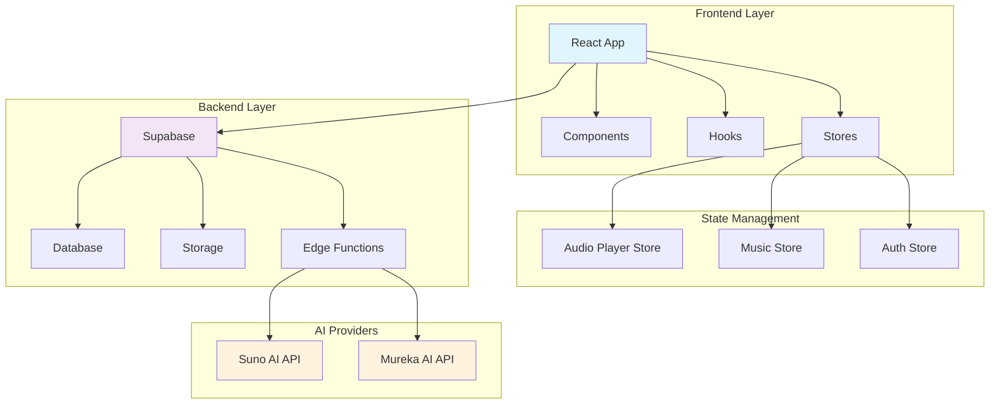

# 🎵 AI Music Studio - Интеллектуальная Музыкальная Платформа

[](https://github.com/your-repo/ai-music-studio)
[](LICENSE)
[](https://reactjs.org/)
[](https://www.typescriptlang.org/)
[](https://supabase.io/)
[](https://tailwindcss.com/)

> 🎼 Современная платформа для создания музыки с помощью искусственного интеллекта, объединяющая возможности Suno AI и Mureka AI в едином интуитивном интерфейсе.

## 📋 Содержание

- [✨ Возможности](#-возможности)
- [🏗️ Архитектура](#️-архитектура)
- [🚀 Быстрый старт](#-быстрый-старт)
- [🔧 Установка](#-установка)
- [📚 API Документация](#-api-документация)
- [🎨 Дизайн-система](#-дизайн-система)
- [🧪 Тестирование](#-тестирование)
- [📈 Версионирование](#-версионирование)
- [🤝 Участие в разработке](#-участие-в-разработке)
- [📄 Лицензия](#-лицензия)

## ✨ Возможности

### 🎵 Генерация музыки
- **Мультипровайдерная поддержка**: Suno AI, Mureka AI и гибридный режим
- **Умные промпты**: Автогенерация и улучшение описаний треков
- **Гибкие настройки**: Стиль, длительность, инструментальность, настраиваемая лирика
- **Реал-тайм прогресс**: Отслеживание статуса генерации в реальном времени

### 🎧 Аудиоплеер
- **Полнофункциональный плеер**: Play/pause, перемотка, управление громкостью
- **Адаптивный дизайн**: Оптимизация для мобильных и десктопных устройств
- **Плейлисты**: Создание и управление плейлистами
- **Режимы воспроизведения**: Shuffle, repeat (one/all)

### 📚 Библиотека треков
- **Облачное хранение**: Интеграция с Supabase Storage
- **Метаданные**: Полная информация о треках (BPM, тональность, теги)
- **Поиск и фильтрация**: Быстрый поиск по названию, стилю, настроению
- **Синхронизация**: Автоматическая синхронизация между устройствами

### 🔐 Аутентификация
- **Secure Auth**: Система аутентификации на базе Supabase
- **Профили пользователей**: Персонализированные настройки
- **RLS Политики**: Row Level Security для защиты данных

## 🏗️ Архитектура



### 📁 Структура проекта

```
src/
├── 📂 components/          # React компоненты
│   ├── 🎵 music/          # Музыкальные компоненты
│   │   ├── MusicStudio.tsx      # Студия генерации
│   │   ├── TrackLibrary.tsx     # Библиотека треков
│   │   ├── GenerationProgress.tsx # Прогресс генерации
│   │   └── player/              # Аудиоплеер
│   ├── 🔐 auth/           # Аутентификация
│   ├── 🎨 ui/             # UI компоненты (shadcn/ui)
│   └── 📄 layout/         # Компоненты макета
├── 📂 hooks/              # React хуки
│   ├── useAudioPlayer.ts        # Логика аудиоплеера
│   ├── useMusicGeneration.ts    # Генерация музыки
│   ├── useUserTracks.ts         # Управление треками
│   └── useRealtimeUpdates.ts    # Реалтайм обновления
├── 📂 stores/             # Zustand стейт менеджеры
├── 📂 services/           # API клиенты
├── 📂 types/              # TypeScript типы
└── 📂 lib/                # Утилиты
```

## 🚀 Быстрый старт

### Предварительные требования

- Node.js 18.0+ 
- npm или yarn
- Аккаунт Supabase
- API ключи от Suno AI и/или Mureka AI

### Развертывание за 5 минут

```bash
# Клонировать репозиторий
git clone https://github.com/your-repo/ai-music-studio.git
cd ai-music-studio

# Установить зависимости
npm install

# Настроить окружение
cp .env.example .env.local
# Отредактировать .env.local с вашими ключами

# Запустить в dev режиме
npm run dev

## 🔧 Установка

### 1. Настройка Supabase

```sql
-- Создание таблиц (автоматически через миграции)
-- Настройка RLS политик
-- Создание storage buckets для аудиофайлов
```

### 2. Переменные окружения

```env
# Supabase
VITE_SUPABASE_URL=your_supabase_url
VITE_SUPABASE_ANON_KEY=your_supabase_anon_key

# AI Providers (в Supabase Secrets)
SUNO_API_KEY=your_suno_api_key
MUREKA_API_KEY=your_mureka_api_key
```

### 3. Запуск

```bash
# Development
npm run dev

# Production build
npm run build
npm run preview
```

## 📚 API Документация

### Edge Functions

#### 🎵 Generate Music
```typescript
POST /functions/v1/generate-music

// Request
interface GenerationRequest {
  prompt: string;              // Описание трека
  provider: 'suno' | 'mureka' | 'test';
  model?: string;             // Модель ИИ
  style?: string;             // Музыкальный стиль
  duration?: number;          // Длительность в секундах
  instrumental?: boolean;     // Инструментальная версия
  lyrics?: string;           // Пользовательские тексты
}
```

### Hooks API

#### 🎧 useAudioPlayer
```typescript
const [playerState, playerActions] = useAudioPlayer();

// State
interface AudioPlayerState {
  currentTrack: Track | null;
  isPlaying: boolean;
  currentTime: number;
  duration: number;
  volume: number;
  playlist: Track[];
  shuffleEnabled: boolean;
  repeatMode: 'none' | 'one' | 'all';
}
```

Полная документация: [docs/API.md](docs/API.md)

## 🎨 Дизайн-система

### Цветовая палитра

```css
:root {
  /* Primary - Фиолетовый градиент */
  --primary: 263 70% 50%;
  
  /* Accent - Зеленый акцент */
  --accent: 142 71% 45%;
  
  /* Градиенты */
  --gradient-primary: linear-gradient(135deg, hsl(263 70% 50%), hsl(142 71% 45%));
  
  /* Эффекты */
  --glow-primary: 0 0 40px hsl(263 70% 50% / 0.3);
}
```

### Компоненты

- **Кнопки**: Варианты default, outline, ghost с анимациями
- **Карточки**: Glassmorphism эффекты с размытием
- **Формы**: Валидация и состояния загрузки
- **Модалы**: Анимированные диалоги и drawer'ы

## 🧪 Тестирование

```bash
# Модульные тесты
npm run test

# E2E тесты
npm run test:e2e

# Покрытие кода
npm run test:coverage
```

## 📈 Версионирование

Используется семантическое версионирование (SemVer):

- **v0.x.x** - Прототип/Альфа версии
- **v1.x.x** - Бета версии  
- **v2.x.x** - Production релизы

### Автоматизация
- Автоматическое обновление версий через GitHub Actions
- Генерация CHANGELOG.md
- Создание релизов с тегами

## 🚀 Деплой

### Vercel (Рекомендуется)
```bash
npm run build
vercel --prod
```

### Через Lovable
Откройте [Lovable проект](https://lovable.dev/projects/ff3ba6e8-b537-4071-8d18-1e2d89c6ea73) и нажмите Share → Publish

### Кастомный домен
Перейдите в Project > Settings > Domains для подключения собственного домена.

## 🤝 Участие в разработке

### Процесс разработки

1. **Fork** репозитория
2. Создать **feature branch** (`git checkout -b feature/amazing-feature`)
3. **Commit** изменения (`git commit -m 'Add amazing feature'`)
4. **Push** в branch (`git push origin feature/amazing-feature`)
5. Открыть **Pull Request**

### Стандарты кода

- **ESLint** + **Prettier** для форматирования
- **TypeScript** strict mode
- **Conventional Commits** для сообщений коммитов
- **Husky** pre-commit hooks

Подробнее: [CONTRIBUTING.md](CONTRIBUTING.md)

### TODO & Roadmap

#### v0.2.0 - Улучшения плеера
- [ ] Визуализация аудио (спектрограмма)
- [ ] Эквалайзер
- [ ] Crossfade между треками
- [ ] Keyboard shortcuts

#### v0.3.0 - Социальные функции  
- [ ] Публичные плейлисты
- [ ] Система лайков и комментариев
- [ ] Профили артистов
- [ ] Sharing в социальные сети

#### v1.0.0 - Production Ready
- [ ] Offline mode
- [ ] Desktop приложение (Electron)
- [ ] Мобильное приложение (React Native)
- [ ] Marketplace для треков

## 📊 Метрики и аналитика

- **Bundle Size**: < 500KB gzipped
- **Performance**: Lighthouse Score 90+
- **Accessibility**: WCAG 2.1 AA compliance
- **SEO**: Meta tags + sitemap

## 🔒 Безопасность

- **RLS** политики для данных пользователей
- **JWT** токены для аутентификации  
- **HTTPS** everywhere
- **Content Security Policy**
- **Rate limiting** для API

## 📞 Поддержка

- 📧 Email: support@ai-music-studio.com
- 💬 Discord: [AI Music Studio](https://discord.gg/ai-music-studio)
- 📖 Docs: [docs.ai-music-studio.com](https://docs.ai-music-studio.com)
- 🐛 Issues: [GitHub Issues](https://github.com/your-repo/ai-music-studio/issues)

## 📄 Лицензия

Этот проект лицензирован под MIT License - см. [LICENSE](LICENSE) файл для деталей.

---

<div align="center">

**[⬆ Наверх](#-ai-music-studio---интеллектуальная-музыкальная-платформа)**

Made with ❤️ by [AI Music Studio Team](https://github.com/your-repo)

[](https://github.com/your-repo/ai-music-studio)
[](https://twitter.com/ai_music_studio)

</div>
