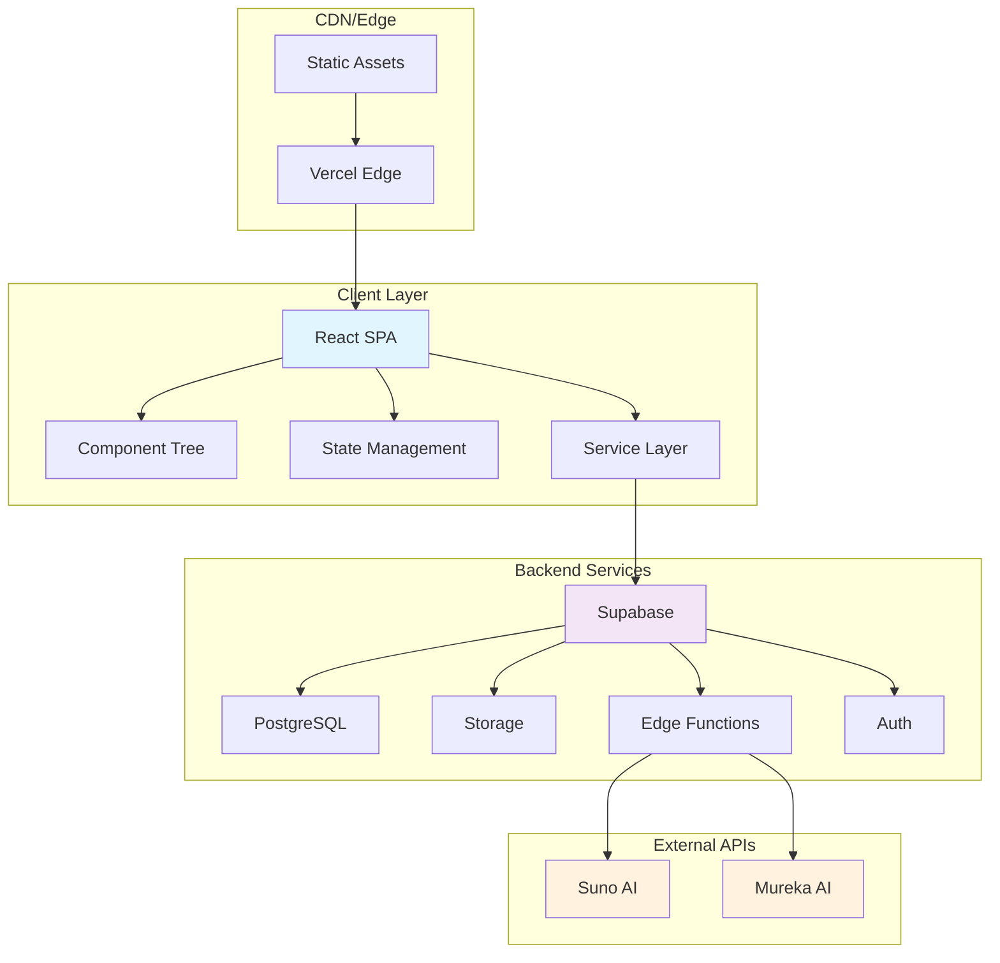
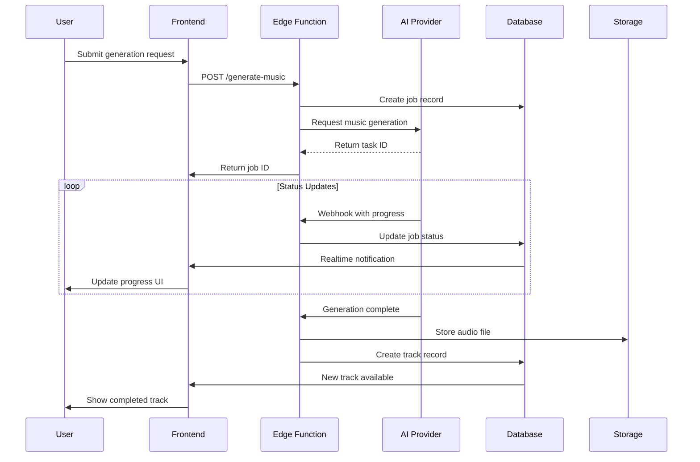
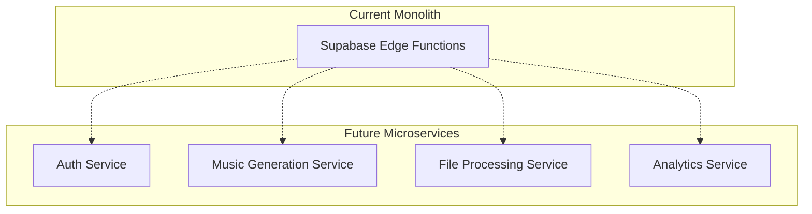

# 🏗️ Architecture Documentation

This document provides a comprehensive overview of the AI Music Studio architecture, design decisions, and system components.

## 📋 Table of Contents

- [System Overview](#system-overview)
- [Frontend Architecture](#frontend-architecture)
- [Backend Architecture](#backend-architecture)
- [Data Flow](#data-flow)
- [State Management](#state-management)
- [API Design](#api-design)
- [Security Model](#security-model)
- [Performance Strategy](#performance-strategy)
- [Scalability Considerations](#scalability-considerations)

## System Overview

AI Music Studio is a modern web application built with a serverless architecture, providing AI-powered music generation capabilities through a responsive React frontend and Supabase backend.

### High-Level Architecture



### Technology Stack

| Layer | Technology | Purpose |
|-------|------------|---------|
| **Frontend** | React 18 + TypeScript | UI components and client logic |
| **Styling** | Tailwind CSS + shadcn/ui | Design system and styling |
| **State** | Zustand + React Query | Client state management |
| **Build** | Vite | Development and build tooling |
| **Backend** | Supabase | Database, auth, storage, functions |
| **Database** | PostgreSQL | Data persistence |
| **Storage** | Supabase Storage | Audio file storage |
| **Functions** | Deno Edge Functions | Serverless backend logic |
| **AI Providers** | Suno AI, Mureka AI | Music generation services |
| **Deployment** | Vercel | Frontend hosting and CDN |

## Frontend Architecture

### Component Architecture

The frontend follows a layered component architecture with clear separation of concerns:

```
src/
├── pages/              # Route-level components
├── components/
│   ├── layout/         # Layout components (Header, Sidebar)
│   ├── ui/             # Base UI primitives (Button, Card)
│   ├── music/          # Domain-specific components
│   └── auth/           # Authentication components
├── hooks/              # Custom React hooks
├── stores/             # Zustand state stores
├── services/           # API clients
└── types/              # TypeScript definitions
```

### Design Patterns

#### 1. Container/Presenter Pattern
```typescript
// Container component - handles logic
function TrackLibraryContainer() {
  const { tracks, loading } = useUserTracks();
  const { playTrack } = useAudioPlayer();
  
  return (
    <TrackLibraryPresenter 
      tracks={tracks}
      loading={loading}
      onPlayTrack={playTrack}
    />
  );
}

// Presenter component - handles presentation
function TrackLibraryPresenter({ tracks, loading, onPlayTrack }) {
  if (loading) return <LoadingSpinner />;
  
  return (
    <div className="grid grid-cols-1 md:grid-cols-3 gap-4">
      {tracks.map(track => (
        <TrackCard key={track.id} track={track} onPlay={onPlayTrack} />
      ))}
    </div>
  );
}
```

#### 2. Custom Hooks Pattern
```typescript
// Encapsulate complex state logic in custom hooks
function useAudioPlayer() {
  const [state, setState] = useState(initialState);
  const audioRef = useRef<HTMLAudioElement>(null);
  
  const actions = useMemo(() => ({
    playTrack: (track: Track) => {
      // Audio playback logic
    },
    pause: () => {
      // Pause logic
    }
  }), []);
  
  return [state, actions] as const;
}
```

#### 3. Compound Components
```typescript
// Flexible, composable components
function AudioPlayer({ children }) {
  const context = useAudioPlayerContext();
  return <div className="audio-player">{children}</div>;
}

AudioPlayer.Controls = AudioPlayerControls;
AudioPlayer.Progress = AudioPlayerProgress;
AudioPlayer.Volume = AudioPlayerVolume;

// Usage
<AudioPlayer>
  <AudioPlayer.Controls />
  <AudioPlayer.Progress />
  <AudioPlayer.Volume />
</AudioPlayer>
```

### State Management Strategy

#### Zustand for Client State
```typescript
// Audio player store
interface AudioPlayerStore {
  // State
  currentTrack: Track | null;
  isPlaying: boolean;
  volume: number;
  
  // Actions
  playTrack: (track: Track) => void;
  setVolume: (volume: number) => void;
}

const useAudioPlayerStore = create<AudioPlayerStore>((set, get) => ({
  currentTrack: null,
  isPlaying: false,
  volume: 1,
  
  playTrack: (track) => set({ currentTrack: track, isPlaying: true }),
  setVolume: (volume) => set({ volume })
}));
```

#### React Query for Server State
```typescript
// Server state management with caching
function useUserTracks() {
  return useQuery({
    queryKey: ['tracks', userId],
    queryFn: () => supabase.from('tracks').select('*'),
    staleTime: 5 * 60 * 1000, // 5 minutes
    refetchOnWindowFocus: false
  });
}
```

## Backend Architecture

### Supabase Integration

#### Database Schema
```sql
-- Core tables with RLS policies
CREATE TABLE tracks (
  id UUID PRIMARY KEY DEFAULT gen_random_uuid(),
  user_id UUID NOT NULL REFERENCES auth.users(id),
  title TEXT NOT NULL,
  file_url TEXT,
  duration INTEGER,
  metadata JSONB,
  created_at TIMESTAMPTZ DEFAULT NOW()
);

-- Row Level Security
ALTER TABLE tracks ENABLE ROW LEVEL SECURITY;

CREATE POLICY "Users can view own tracks" ON tracks
  FOR SELECT USING (auth.uid() = user_id);
```

#### Edge Functions
```typescript
// Serverless functions for complex operations
serve(async (req) => {
  // Authentication
  const user = await authenticateUser(req);
  
  // Business logic
  const result = await generateMusic(request);
  
  // Response
  return new Response(JSON.stringify(result), {
    headers: { 'Content-Type': 'application/json' }
  });
});
```

### AI Provider Integration

#### Abstraction Layer
```typescript
// Unified interface for multiple AI providers
abstract class AIProvider {
  abstract generate(request: GenerationRequest): Promise<GenerationResult>;
  abstract getStatus(jobId: string): Promise<JobStatus>;
}

class SunoProvider extends AIProvider {
  async generate(request: GenerationRequest) {
    const response = await fetch('https://api.suno.ai/v1/generate', {
      method: 'POST',
      headers: { 'Authorization': `Bearer ${this.apiKey}` },
      body: JSON.stringify(request)
    });
    return response.json();
  }
}
```

#### Webhook Handling
```typescript
// Handle async callbacks from AI providers
serve(async (req) => {
  const { taskId, status, result } = await req.json();
  
  // Update job status in database
  await supabase
    .from('generation_jobs')
    .update({ status, result })
    .eq('task_id', taskId);
  
  // Notify frontend via realtime
  await supabase.channel('job_updates').send({
    type: 'broadcast',
    event: 'job_complete',
    payload: { taskId, status }
  });
});
```

## Data Flow

### Music Generation Flow



### Real-time Updates

```typescript
// Subscribe to database changes
useEffect(() => {
  const channel = supabase
    .channel('generation_jobs')
    .on('postgres_changes', {
      event: 'UPDATE',
      schema: 'public',
      table: 'generation_jobs',
      filter: `user_id=eq.${userId}`
    }, (payload) => {
      updateJobStatus(payload.new);
    })
    .subscribe();

  return () => supabase.removeChannel(channel);
}, [userId]);
```

## API Design

### RESTful Endpoints

```typescript
// Edge Functions following REST conventions
POST   /functions/v1/generate-music     # Create generation job
GET    /functions/v1/jobs/:id           # Get job status
POST   /functions/v1/generate-lyrics    # Generate lyrics
PUT    /functions/v1/tracks/:id         # Update track metadata
DELETE /functions/v1/tracks/:id         # Delete track
```

### GraphQL-style Queries (Supabase)
```typescript
// Flexible data fetching with PostgREST
const { data: tracks } = await supabase
  .from('tracks')
  .select(`
    id,
    title,
    duration,
    file_url,
    playlists:playlist_tracks(
      playlist:playlists(name)
    )
  `)
  .eq('user_id', userId)
  .order('created_at', { ascending: false });
```

## Security Model

### Authentication & Authorization

```typescript
// JWT-based authentication
const authMiddleware = async (req: Request) => {
  const token = req.headers.get('Authorization')?.replace('Bearer ', '');
  const { user, error } = await supabase.auth.getUser(token);
  
  if (error || !user) {
    throw new Error('Unauthorized');
  }
  
  return user;
};
```

### Row Level Security (RLS)
```sql
-- Data isolation at database level
CREATE POLICY "isolation_policy" ON tracks
  FOR ALL USING (auth.uid() = user_id);

-- Admin access
CREATE POLICY "admin_access" ON tracks
  FOR ALL USING (
    EXISTS (
      SELECT 1 FROM profiles 
      WHERE id = auth.uid() 
      AND role = 'admin'
    )
  );
```

### Content Security Policy
```typescript
// Prevent XSS and other attacks
const securityHeaders = {
  'Content-Security-Policy': `
    default-src 'self';
    script-src 'self' 'unsafe-inline';
    style-src 'self' 'unsafe-inline';
    img-src 'self' data: https:;
    media-src 'self' https://storage.supabase.co;
  `
};
```

## Performance Strategy

### Frontend Optimization

#### Code Splitting
```typescript
// Lazy load heavy components
const MusicStudio = lazy(() => import('./components/music/MusicStudio'));
const TrackLibrary = lazy(() => import('./components/music/TrackLibrary'));

function App() {
  return (
    <Suspense fallback={<LoadingSpinner />}>
      <Routes>
        <Route path="/studio" element={<MusicStudio />} />
        <Route path="/library" element={<TrackLibrary />} />
      </Routes>
    </Suspense>
  );
}
```

#### Memoization
```typescript
// Prevent unnecessary re-renders
const TrackCard = memo(({ track, onPlay }) => {
  const handlePlay = useCallback(() => {
    onPlay(track);
  }, [track, onPlay]);
  
  return (
    <Card onClick={handlePlay}>
      {/* Card content */}
    </Card>
  );
});
```

#### Virtual Scrolling
```typescript
// Handle large track lists efficiently
function VirtualTrackList({ tracks }) {
  const containerRef = useRef<HTMLDivElement>(null);
  const [visibleRange, setVisibleRange] = useState({ start: 0, end: 20 });
  
  const visibleTracks = tracks.slice(visibleRange.start, visibleRange.end);
  
  return (
    <div ref={containerRef} className="h-96 overflow-auto">
      {visibleTracks.map(track => (
        <TrackCard key={track.id} track={track} />
      ))}
    </div>
  );
}
```

### Backend Optimization

#### Database Indexes
```sql
-- Optimize common queries
CREATE INDEX idx_tracks_user_created 
ON tracks(user_id, created_at DESC);

CREATE INDEX idx_tracks_genre 
ON tracks USING GIN((metadata->>'genre'));
```

#### Caching Strategy
```typescript
// Redis-like caching with Supabase
const CACHE_DURATION = 5 * 60 * 1000; // 5 minutes

async function getCachedTracks(userId: string) {
  const cacheKey = `tracks:${userId}`;
  
  // Try cache first
  const cached = await cache.get(cacheKey);
  if (cached) return cached;
  
  // Fetch from database
  const tracks = await supabase
    .from('tracks')
    .select('*')
    .eq('user_id', userId);
  
  // Cache result
  await cache.set(cacheKey, tracks, CACHE_DURATION);
  
  return tracks;
}
```

## Scalability Considerations

### Horizontal Scaling

#### Database Scaling
- **Read Replicas**: Distribute read operations
- **Connection Pooling**: Optimize database connections
- **Partitioning**: Split large tables by user or date

#### Storage Scaling
- **CDN Integration**: Global content delivery
- **Compression**: Optimize audio file sizes
- **Lazy Loading**: Load content on demand

### Vertical Scaling

#### Performance Monitoring
```typescript
// Track application metrics
const metrics = {
  trackGenerationTime: performance.now() - startTime,
  audioLoadTime: audio.readyState === 4 ? performance.now() - audioStartTime : null,
  componentRenderTime: useRenderTime()
};

// Send to analytics
analytics.track('performance_metrics', metrics);
```

#### Resource Optimization
- **Bundle Analysis**: Monitor bundle size
- **Memory Management**: Prevent memory leaks
- **CPU Optimization**: Optimize heavy computations

### Future Architecture Considerations

#### Microservices Migration


#### Event-Driven Architecture
```typescript
// Event-driven communication
interface DomainEvent {
  id: string;
  type: string;
  timestamp: Date;
  payload: unknown;
}

class EventBus {
  async publish(event: DomainEvent) {
    // Publish to message queue
  }
  
  async subscribe(eventType: string, handler: EventHandler) {
    // Subscribe to events
  }
}

// Usage
eventBus.publish({
  id: uuid(),
  type: 'TRACK_GENERATED',
  timestamp: new Date(),
  payload: { trackId, userId }
});
```

This architecture provides a solid foundation for the current application while maintaining flexibility for future growth and enhancements.